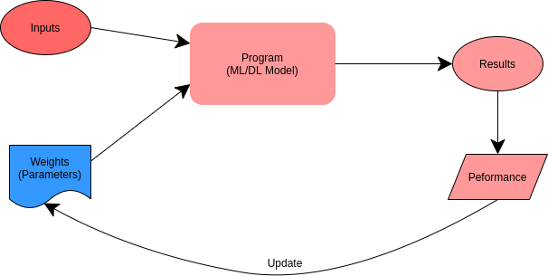
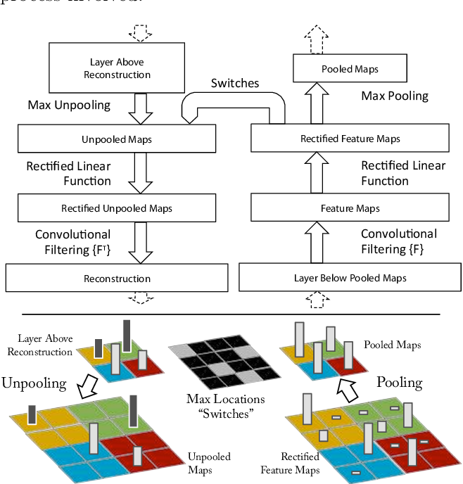
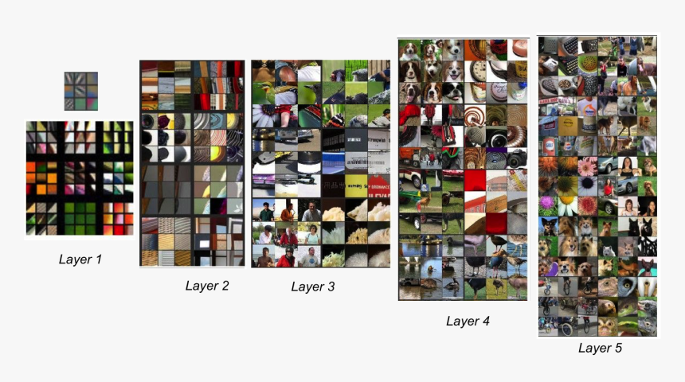

# Practical Machine Learning Introduction

## How can you get free computation resource for Machine Learning 

	* [Kaggle](https://www.kaggle.com/)

	* [Google Colab](https://colab.research.google.com/)

	* [DataCruch.io](https://datacrunch.io/) -- Running a full Linux Server(free credits need By writing a blogpost or creating a video using DataCrunch services)

## WHat is Machine Learning?

Machine Learning:

The training of programs developed by allowing a computer to learn from it's experience, rather than through manually coding the individuals steps.

### Limitions inherent to Machine Learning:

  * A model can not be created without data;

  * A model can only learn to operate on the paterns seen in the input data used to train it;

  * This learning approach only creates **predictions**, not recommend *actions*;

  * It is not enough to just have examples of input data, we need **labels** for that data too;

Most of time the tricky part is **labeling it**.

## Transfer Learning

Some times you can take knowledge of the NN(Neural Network) **has learned** from one task and **apply** that knowle4dge to a seprated taskl

Two steps of Transfer Learning:

  * Using a **pretrained model** for a task different to what it was originally trained for.

  * **Fine tune** is what we do when we are transfer learning. 

Transfer Learning is the single most important thing for being able to use **less data** and **less compute** and get **better accuracy**

### When Does Transfer Learning Make Sense?

Transfer Learning make sense when you have **a lot of data for the problem** where you are **transfering from** and usually relatively **less data** for the problem you are **transfering to**.

Transfer from A ---> B

  * Task A and B have the same Input X

  * You have a lot more data for Task A than Task B

  * Low level features from A could b e helpful for Learning B

### Why Transfer Learning work?

Paper: "Visualizing and Understanding Convolutional Networks", 2013, Phd Student, Matt Zeiler

 

 

A lot of the **low level features** such as "detecting edges", "detecting curves", "detecting positive objects". Learning from that, from a very large image recognition data set might help your learning algorithm do better in radiology diagnosis. It just learned a log about the structure and nature of how images look like and some of what knowledge will be useful.

### Big Dataset for Transfer Learning 

  * Image Net: 1.3 million labeled Image Data

